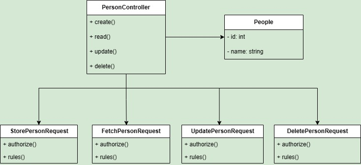

# REST API with Basic CRUD Operation

This is a REST API with basic CRUD operation. It is built with Laravel 10 and MySQL 8.0.30. It is a simple API that can be used to create, read, update and delete 'person' resource.

## Table of Contents
- [Installation](#installation)
- [Configuration](#configuration)
- [Usage](#usage)
- [Error Handling](#error-handling)
- [Testing](#testing)
- [UML Diagram](#uml-diagram)
- [License](#license)

## Installation
- Create a folder for the project and clone the repository into the folder.
- Install the dependencies by running the following command in the terminal:
    > composer install

- Create an environment file by running the following command in the terminal:
    > cp .env.example .env

- Generate a new application key by running the following command in the terminal:
    > php artisan key:generate

- Create a database for the project and update the database credentials in the .env file.
- Run the following command in the terminal to migrate the database:
    > php artisan migrate

    Additionally, you can populate the database tables by running the following command instead:
    > php artisan migrate --seed

- Run the following command in the terminal to start the server:
    > php artisan serve

## Configuration
- The API can be configured to use a different database by updating the database credentials in the .env file.
- The API can be configured to use a different base URL by updating the APP_URL variable in the .env file. By default, the base URL is set to http://localhost:8000

## Usage
- Base URL: http://localhost:8000
- Detailed documentation of the API can be found here: [API Documentation](DOCUMENTATION.md)

### Add a new person.

**Request:**

```http
POST /api
Content-Type: application/json

{
  "name": "John Doe"
}
```

**Response:**

```json
Status: 200 OK
Content-Type: application/json

[
  {
    "id": 1,
    "name": "John Doe"
  }
]
```

### Fetching details of a person.

**Request:**

```http
GET /api/{id}
```

**Response:**

```json
Status: 200 OK
Content-Type: application/json

{
  "id": 1,
  "name": "John Doe",
}
```

### Updating details of a person.

**Request:**

```http
PUT /api/{id}
Content-Type: application/json

{
  "name": "Updated User",
}
```

**Response:**

```json
Status: 200 OK
Content-Type: application/json

{
  "id": 1,
  "name": "Updated User"
}
```

### Deleting a person.

**Request:**

```http
DELETE /api/{id}
```

**Response:**

```json
Status: 204 No Content
```

Note: Replace `{id}` in the URLs with the actual ID of the user you want to retrieve, update, or delete.

## Error Handling
The API returns the following in case of an error:

```json
Status: Error Code
Content-Type: application/json

{
    "error": "Error Message"
}
```

## Testing
- Postman was used to test the API. The collection of the test requests can be found here:

    [](https://app.getpostman.com/run-collection/27453333-98cba097-2f3c-4bb6-92bd-99da33f5fd9e?action=collection%2Ffork&source=rip_markdown&collection-url=entityId%3D27453333-98cba097-2f3c-4bb6-92bd-99da33f5fd9e%26entityType%3Dcollection%26workspaceId%3D377a6ae1-5702-4db6-82b4-c3e7c002ac52)

## UML Diagram


## License
The Laravel framework is open-sourced software licensed under the [MIT license](https://opensource.org/licenses/MIT).
<p align="left">

</p>
